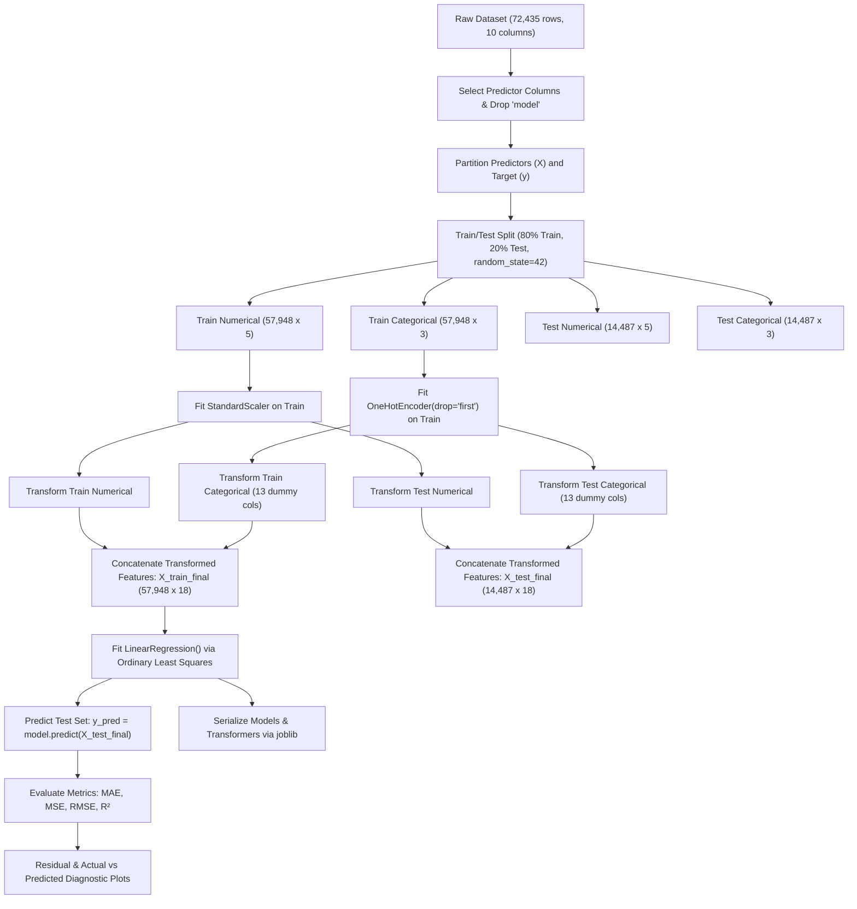

# Used Car Price Prediction

A machine learning regression project developed with scikit-learn to estimate used car prices based on core vehicle specifications and attributes.

---

## Table of Contents

- [Overview](#overview)
- [Project Objective](#project-objective)
- [Dataset](#dataset)
- [Features](#features)
- [Machine Learning Workflow](#machine-learning-workflow)
- [Data Preprocessing](#data-preprocessing)
- [Model](#model)
- [Evaluation Metrics](#evaluation-metrics)
- [Results](#results)
- [Visualizations](#visualizations)
- [Polynomial Regression Experiment](#polynomial-regression-experiment)
- [Model Limitations](#model-limitations)
- [Future Improvements](#future-improvements)
- [Model Packaging](#model-packaging)
- [Project Structure](#project-structure)
- [Technologies Used](#technologies-used)
- [How to Run](#how-to-run)
- [Key Learnings](#key-learnings)
- [Conclusion](#conclusion)
- [Dataset Attribution](#dataset-attribution)

---

## Overview

Pricing used cars accurately is a common real-world regression challenge. Vehicle valuations are shaped by a combination of quantitative wear-and-tear indicators (age, odometer mileage, fuel economy) and qualitative categorical characteristics (brand manufacturer, transmission type, fuel type).

This project constructs a structured, leak-free regression pipeline in Python using `scikit-learn`. The pipeline ingests tabular vehicle records, handles categorical encoding and numerical standardization, trains a Multiple Linear Regression model, analyzes residual diagnostics, and serializes all transformers and fitted estimators for downstream inference.

---

## Project Objective

The objectives of this project are:
1. **Practical Regression Application**: Build an end-to-end machine learning system capable of estimating the market price of a used vehicle from observable attributes.
2. **Standard Preprocessing Best Practices**: Implement a leak-free transformation pipeline that scales continuous numerical features using `StandardScaler` and encodes categorical attributes using `OneHotEncoder(drop='first')`, deriving parameters exclusively from the training split.
3. **Rigorous Diagnostic Evaluation**: Assess model performance using standard regression metrics (MAE, MSE, RMSE, and $R^2$) and analyze prediction errors through actual-versus-predicted and residual plots.
4. **Model Serialization**: Persist trained encoders, scalers, and estimators to disk using `joblib` for reproducible offline inference.

> [!NOTE]
> Unlike earlier foundational projects in this repository that implemented optimization routines from scratch via NumPy, this project focuses on production-standard workflows using `scikit-learn`.

---

## Dataset

The project uses the **CARS DATASET (Audi, BMW, Ford, Hyundai, Skoda, VW)** sourced from Kaggle.

- **Source**: [Kaggle - CARS DATASET](https://www.kaggle.com/datasets/aishwaryamuthukumar/cars-dataset-audi-bmw-ford-hyundai-skoda-vw)
- **Dataset Size**: 72,435 records, 10 columns
- **Missing Values**: 0 missing or null values across the entire dataset
- **Target Variable**: `price` (discrete integer representing vehicle price in GBP / currency units)

The dataset aggregates used vehicle listings across seven major automotive manufacturers: Audi, BMW, Ford, Hyundai, Skoda, Toyota, and Volkswagen.

---

## Features

The original dataset provides 9 candidate predictor variables and 1 target variable (`price`).

### Feature Breakdown

| Feature | Type | Description | Used in Model? |
| :--- | :--- | :--- | :---: |
| `price` | Numerical (Integer) | Listed market sale price of the vehicle (**Target variable**) | Target ($y$) |
| `year` | Numerical (Integer) | Registration year of the vehicle | Yes |
| `mileage` | Numerical (Integer) | Total distance accumulated on the odometer | Yes |
| `tax` | Numerical (Float) | Annual road tax liability | Yes |
| `mpg` | Numerical (Float) | Manufacturer-rated fuel efficiency (miles per gallon) | Yes |
| `engineSize` | Numerical (Float) | Engine displacement capacity in liters | Yes |
| `Make` | Categorical (String) | Vehicle brand manufacturer (7 unique brands) | Yes |
| `fuelType` | Categorical (String) | Engine fuel classification (Petrol, Diesel, Hybrid, Electric, Other) | Yes |
| `transmission`| Categorical (String) | Gearbox mechanism (Manual, Automatic, Semi-Auto, Other) | Yes |
| `model` | Categorical (String) | Specific vehicle model name (146 distinct categories) | No (Excluded) |

### Design Rationale for Excluding `model`

The `model` column was deliberately omitted during feature selection. This decision was guided by two considerations:
1. **High Cardinality**: The column contains 146 unique model identifiers (e.g., `A1`, `Focus`, `Golf`, `3 Series`, `Tucson`). One-hot encoding `model` would introduce 145 sparse binary columns, substantially expanding feature dimensionality and increasing memory consumption.
2. **Model Generalization Scope**: The project was designed as a generalized car-price estimator based on physical and economic vehicle attributes (engine capacity, efficiency, brand tier, mileage, age) rather than a lookup table of individual model trims.

Excluding `model` is a deliberate architectural choice balancing model simplicity, generalization, and computational footprint. It is not asserted as objectively superior to model-inclusive architectures.

---

## Machine Learning Workflow

The execution workflow proceeds through the following sequential stages:



---

## Data Preprocessing

Data preprocessing guarantees that inputs are correctly formatted for linear modeling while preventing data leakage between evaluation partitions.

### 1. Train / Test Split
Before any statistical transformations were calculated, the 72,435 observations were split using an 80/20 ratio:
- **Training Set**: 80% (57,948 samples)
- **Test Set**: 20% (14,487 samples)
- Splitting before transformation ensures the test partition functions strictly as unseen data.

### 2. Numerical Feature Standardization
Linear regression calculates coefficients based on input magnitude. Features measured on wildly divergent scales (e.g., `mileage` reaching tens of thousands versus `engineSize` ranging from 0.0 to 6.6) can hinder numerical stability and distort direct coefficient comparison.

Standardization was applied using `StandardScaler`:

$$z = \frac{x - \mu_{\text{train}}}{\sigma_{\text{train}}}$$

The numerical feature set comprises 5 variables: `year`, `mileage`, `tax`, `mpg`, and `engineSize`.

### 3. Categorical One-Hot Encoding
Multiple linear regression operates on numerical matrices and cannot directly process text categories. `OneHotEncoder` was fitted to the three categorical variables:
- `Make` (7 categories $\rightarrow$ 6 binary indicators)
- `fuelType` (5 categories $\rightarrow$ 4 binary indicators)
- `transmission` (4 categories $\rightarrow$ 3 binary indicators)

Setting `drop='first'` omits the reference level for each categorical variable, producing 13 dummy features. This prevents perfect multicollinearity (the "dummy variable trap"), ensuring the feature design matrix $\mathbf{X}$ remains full rank for matrix inversion.

### 4. Prevention of Data Leakage
To prevent test set contamination:
- `StandardScaler.fit()` was invoked exclusively on `X_train[numerical_cols]`.
- `OneHotEncoder.fit()` was invoked exclusively on `X_train[categorical_cols]`.
- Test subsets were transformed using `transform()` with the parameters ($\mu_{\text{train}}$, $\sigma_{\text{train}}$, and category dictionaries) frozen from the training split.
- The resulting design matrices contain 18 total features (5 scaled numerical + 13 one-hot encoded).

---

## Model

The baseline model is **Multiple Linear Regression**, implemented via `sklearn.linear_model.LinearRegression`.

### Conceptual Formulation

Multiple Linear Regression models the expected value of target variable $y$ as a linear combination of $n$ input features:

$$y = \beta_0 + \beta_1 x_1 + \beta_2 x_2 + \dots + \beta_n x_n + \epsilon$$

In vectorized matrix notation across all samples:

$$\hat{\mathbf{y}} = \mathbf{X}\mathbf{w} + b$$

Where:
- $\hat{\mathbf{y}} \in \mathbb{R}^{m}$ is the vector of predicted vehicle prices.
- $\mathbf{X} \in \mathbb{R}^{m \times 18}$ is the transformed design matrix containing standardized numerical values and binary indicators.
- $\mathbf{w} \in \mathbb{R}^{18}$ is the learned weight vector (regression coefficients).
- $b \in \mathbb{R}$ is the intercept term (expected vehicle price when all standardized features equal zero and categorical features sit at reference levels).
- $\epsilon$ represents residual error unexplained by the linear assumption.

### Rationale for Multiple Linear Regression as a Baseline
1. **Computational Efficiency**: Closed-form Ordinary Least Squares (OLS) solutions solve instantaneously over 57,000+ training records.
2. **Interpretability**: Each learned coefficient directly represents the expected marginal change in price per standard-deviation change in a numerical feature or presence of a categorical attribute.
3. **Benchmark Foundation**: Establishing an OLS baseline provides a rigorous mathematical reference against which more complex nonlinear models (such as polynomial expansions or gradient boosted trees) can be objectively benchmarked.

---

## Evaluation Metrics

Model performance is evaluated on the unseen test set ($m_{\text{test}} = 14,487$) across four standard regression metrics:

### 1. Mean Absolute Error (MAE)
$$\text{MAE} = \frac{1}{m} \sum_{i=1}^{m} \left| y_i - \hat{y}_i \right|$$
MAE measures the average absolute magnitude of prediction errors in the original currency units. Unlike squared metrics, MAE treats all error magnitudes linearly, providing an intuitive measure of typical error.

### 2. Mean Squared Error (MSE)
$$\text{MSE} = \frac{1}{m} \sum_{i=1}^{m} \left( y_i - \hat{y}_i \right)^2$$
MSE computes the average squared deviation between true prices and predictions. Because errors are squared before averaging, larger mispredictions contribute disproportionately to the total penalty.

### 3. Root Mean Squared Error (RMSE)
$$\text{RMSE} = \sqrt{\text{MSE}} = \sqrt{\frac{1}{m} \sum_{i=1}^{m} \left( y_i - \hat{y}_i \right)^2}$$
RMSE restores the error penalty to the original unit scale of vehicle price. It acts as an upper-bound check on error dispersion: a substantially higher RMSE relative to MAE indicates the presence of severe outliers.

### 4. Coefficient of Determination ($R^2$)
$$R^2 = 1 - \frac{\sum_{i=1}^{m} (y_i - \hat{y}_i)^2}{\sum_{i=1}^{m} (y_i - \bar{y})^2}$$
$R^2$ quantifies the proportion of price variance explained by the model relative to a naive baseline that always predicts the mean price $\bar{y}$. An $R^2$ of 1.0 indicates perfect prediction, while 0.0 indicates performance equivalent to the mean baseline.

---

## Results

Evaluation of the Multiple Linear Regression model on the 80/20 test split ($N = 14,487$) yields the following metrics:

| Metric | Test Set Value | Practical Interpretation |
| :--- | :---: | :--- |
| **Mean Absolute Error (MAE)** | `2,862.65` | On average, the model's price predictions deviate by approximately **£2,862.65** from the true vehicle listing price. |
| **Mean Squared Error (MSE)** | `21,118,264.11` | Quantifies variance of the prediction errors, penalizing large residual deviations heavily. |
| **Root Mean Squared Error (RMSE)** | `4,595.46` | The standard deviation of the unexplained residuals is approximately **£4,595.46**, reflecting greater sensitivity to high-value vehicle outliers. |
| **Coefficient of Determination ($R^2$)** | `0.7618` | The 18 linear and one-hot encoded features account for approximately **76.18%** of the variance in used car prices on the test split. |

### Interpretation
An $R^2$ score of approximately 0.762 confirms that observable attributes—primarily vehicle age, mileage accumulation, engine capacity, fuel efficiency, and brand tier—possess substantial explanatory power over used car valuations within a linear framework. However, the gap between MAE (£2,862.65) and RMSE (£4,595.46) reveals that while typical predictions stay within an acceptable range, the model produces large errors on certain high-end, premium, or vintage vehicles.

---

## Visualizations

The project notebook generates two primary diagnostic figures to evaluate model predictions and inspect residual behavior.

### 1. Actual vs. Predicted Plot

```text
Predicted Price
      ^
      |                .  / (Overprediction Zone)
      |              .  /
      |            .  / . 
      |          .  / . . 
      |        .  / . . 
      |      .  / . 
      |    .  /
      |  .  / (Underprediction Zone)
      +---------------------------------> Actual Price
            y = x (Ideal Reference Line)
```

- **Reference Diagonal Line ($y = x$)**: Represents theoretically perfect predictions where $\hat{y}_i = y_i$.
- **Points Above the Diagonal**: Represent **overprediction**, where the model estimates a price higher than the actual recorded listing price ($\hat{y}_i > y_i$).
- **Points Below the Diagonal**: Represent **underprediction**, where the model estimates a price lower than the actual recorded listing price ($\hat{y}_i < y_i$).
- **Diagnostic Finding**: For vehicles priced between £5,000 and £30,000, data points cluster closely along the diagonal. However, as actual prices exceed £40,000, predictions systematically fall below the line, indicating that linear regression underpredicts luxury, performance, and rare vehicle prices.

### 2. Residual Analysis Plot

Residuals are defined as the difference between ground truth prices and model estimates:

$$e_i = y_i - \hat{y}_i$$

- **Ideal Residual Behavior**: In a well-specified linear model adhering to Gauss-Markov assumptions, residuals should be randomly distributed around zero ($e_i = 0$) with uniform variance across all price levels (homoscedasticity).
- **Observed Residual Behavior**:
  - Residuals exhibit heteroscedasticity: error variance widens significantly at higher price tiers.
  - A subtle curvature is visible across certain intervals, indicating that price depreciation over time and mileage follows a nonlinear (exponential or power) curve rather than a strictly constant linear slope.

---

## Polynomial Regression Experiment

To test whether the linear model was constrained by its additive functional form, an exploratory **Polynomial Regression** experiment was conducted within the project notebook (`notebooks/train.ipynb`).

### Experimental Configuration
Using `sklearn.preprocessing.PolynomialFeatures(degree=2, include_bias=False)` on the 18 transformed features:
- All original terms, squared terms ($x_j^2$), and pairwise interaction terms ($x_j x_k$) were generated.
- A secondary `LinearRegression` estimator was fitted on the expanded polynomial feature space.

### Comparative Performance

| Model Architecture | MAE | RMSE | $R^2$ Score |
| :--- | :---: | :---: | :---: |
| **Baseline Multiple Linear Regression** | `2,862.65` | `4,595.46` | `0.7618` |
| **Polynomial Regression (Degree 2)** | `2,123.10` | `3,233.76` | `0.8704` |

### Key Observations
- Incorporating degree-2 polynomial and interaction terms increased the explained variance ($R^2$) from **76.2% to 87.0%**.
- MAE decreased by approximately **£740** per vehicle, confirming that pricing dynamics exhibit meaningful nonlinear relationships and cross-feature interactions (e.g., interaction between vehicle age and mileage accumulation).
- While polynomial features improve fitting, they substantially expand dimensionality and increase susceptibility to overfitting if not paired with regularization.

---

## Model Limitations

Documented limitations based on empirical findings from the project:

1. **Linearity Assumption**: Multiple Linear Regression assumes a strictly additive linear relationship between the transformed features and vehicle price. Real-world vehicle depreciation typically follows an exponential decay curve, where value drops rapidly in the first 3 years before leveling off.
2. **Exclusion of Vehicle Model**: Dropping the `model` column strips out model-specific pricing premiums (e.g., an Audi RS6 commands a substantial premium over an Audi A6 despite sharing brand and engine capacity).
3. **Heteroscedastic Residuals**: Prediction error dispersion scales with vehicle value; the model is substantially less reliable for luxury, sports, or commercial vehicles exceeding £40,000.
4. **Market & Geographic Specificity**: The dataset captures UK used-car listings from seven specific manufacturers. It does not generalize to different geographic markets, right-hand versus left-hand drive regions, or unrepresented brands.

---

## Future Improvements

Potential enhancements identified for future project iterations:

- **Tree-Based Ensembles**: Benchmark performance against non-parametric algorithms such as Random Forest Regressor, LightGBM, and XGBoost to naturally capture nonlinearities and thresholds without manual feature expansion.
- **Handling High-Cardinality Categories**: Incorporate `model` using advanced encoding techniques such as Target Encoding, Frequency Encoding, or learned entity embeddings.
- **Regularized Regression**: Apply Ridge ($L_2$) and Lasso ($L_1$) regression to the polynomial feature space to prevent potential overfitting and prune redundant interaction terms.
- **Target Transformation**: Model $\log(\text{price})$ instead of raw price to stabilize variance, enforce non-negative predictions, and naturally model percentage-based depreciation rates.
- **Cross-Validation**: Implement $k$-fold cross-validation to assess parameter stability across varying data partitions.

---

## Model Packaging

Trained transformation objects and estimators are serialized using `joblib` inside the `models/` directory for persistence and reproducible inference.

### Serialized Artifacts

The repository contains five serialized `.pkl` files:
- `models/encoder.pkl`: Fitted `OneHotEncoder(drop='first')` for categorical columns (`Make`, `fuelType`, `transmission`).
- `models/scaler.pkl`: Fitted `StandardScaler` for numerical columns (`year`, `mileage`, `tax`, `mpg`, `engineSize`).
- `models/linear_model.pkl`: Fitted baseline `LinearRegression` estimator.
- `models/poly_features.pkl`: Fitted `PolynomialFeatures(degree=2, include_bias=False)` transformer from the polynomial experiment.
- `models/model.pkl`: Fitted `LinearRegression` estimator trained on the polynomial feature representation.

### Loading Artifacts for Inference

The following code demonstrates how to restore the baseline preprocessing pipeline and generate predictions for new vehicle records:

```python
import joblib
import numpy as np
import pandas as pd

# 1. Load serialized transformers and model
encoder = joblib.load("models/encoder.pkl")
scaler = joblib.load("models/scaler.pkl")
model = joblib.load("models/linear_model.pkl")

# 2. Define sample raw vehicle data
sample_cars = pd.DataFrame([
    {
        "year": 2018,
        "mileage": 22000,
        "tax": 145.0,
        "mpg": 55.4,
        "engineSize": 2.0,
        "Make": "audi",
        "fuelType": "Diesel",
        "transmission": "Automatic"
    }
])

# 3. Apply identical preprocessing transformations
num_cols = ["year", "mileage", "tax", "mpg", "engineSize"]
cat_cols = ["Make", "fuelType", "transmission"]

sample_num_scaled = scaler.transform(sample_cars[num_cols])
sample_cat_encoded = encoder.transform(sample_cars[cat_cols])

sample_final = np.hstack([sample_num_scaled, sample_cat_encoded])

# 4. Generate price prediction
predicted_price = model.predict(sample_final)
print(f"Predicted Car Price: £{predicted_price[0]:,.2f}")
```

---

## Project Structure

The project structure corresponds to the files present in the repository:

```text
used-car-price-linear-regression/
├── dataset/
│   └── cars_dataset.csv       # Raw Kaggle dataset (72,435 rows, 10 columns)
├── models/
│   ├── encoder.pkl            # Fitted OneHotEncoder for categorical features
│   ├── linear_model.pkl       # Fitted baseline LinearRegression model
│   ├── model.pkl              # Fitted Polynomial LinearRegression model
│   ├── poly_features.pkl      # Fitted PolynomialFeatures (degree=2) transformer
│   └── scaler.pkl             # Fitted StandardScaler for numerical features
├── notebooks/
│   └── train.ipynb            # Jupyter Notebook with data prep, training, plots & exports
├── .gitignore                 # Git ignore rules
└── README.md                  # Project documentation and engineering report
```

---

## Technologies Used

- **Python**: Core programming language
- **Pandas**: Tabular data manipulation, schema inspection, and subset selection
- **NumPy**: Matrix concatenation and vectorized numerical operations
- **Scikit-learn**: Preprocessing (`StandardScaler`, `OneHotEncoder`, `PolynomialFeatures`), modeling (`LinearRegression`), and evaluation metrics (`mean_absolute_error`, `mean_squared_error`, `r2_score`)
- **Matplotlib**: Diagnostic visualizations (actual vs. predicted and residual scatter plots)
- **Joblib**: Model and transformer serialization for inference deployment
- **Jupyter Notebook**: Interactive experimentation and development environment

---

## How to Run

### Prerequisites
- Python 3.10 or higher
- Git

### 1. Clone the Repository
```bash
git clone https://github.com/jayranedev/used-car-price-linear-regression.git
cd used-car-price-linear-regression
```

### 2. Set Up a Virtual Environment
```bash
# Windows
python -m venv venv
venv\Scripts\activate

# Linux / macOS
python3 -m venv venv
source venv/bin/activate
```

### 3. Install Dependencies
```bash
pip install numpy pandas scikit-learn matplotlib joblib jupyter
```

### 4. Run the Training Notebook
Launch Jupyter Notebook to execute or inspect the training workflow:
```bash
jupyter notebook notebooks/train.ipynb
```

---

## Key Learnings

This project demonstrates several core machine learning engineering practices:
- **End-to-End Regression Workflow**: Ingesting tabular raw data, partitioning features, training estimators, assessing residual plots, and deploying serialized weights.
- **Categorical Encoding Strategy**: Employing `OneHotEncoder(drop='first')` to represent multi-class categorical features without triggering multicollinearity.
- **Disciplined Scaling**: Using `StandardScaler` fitted strictly on training observations to guarantee no test data leakage occurs during preprocessing.
- **Comprehensive Model Evaluation**: Evaluating models across multiple complementary metrics (MAE, MSE, RMSE, $R^2$) to discern typical errors from outlier sensitivity.
- **Residual Diagnostic Literacy**: Reading actual-versus-predicted plots and identifying heteroscedasticity and nonlinear trends through residual examination.
- **Artifact Serialization**: Persisting both transformers and estimators in tandem so that raw input data can be preprocessed identically during inference.

---

## Conclusion

This project successfully constructs a robust, leak-free Multiple Linear Regression pipeline for used car price prediction. Achieving an $R^2$ of **0.7618** and an MAE of **£2,862.65** on unseen test data, the linear baseline effectively captures the primary financial depreciation drivers across 72,000+ vehicle records. 

Subsequent experiments with degree-2 polynomial features demonstrated that modeling nonlinear interactions boosts explained variance to **87.04%**, providing a clear empirical roadmap for future iterations utilizing tree-based ensemble algorithms.

---

## Dataset Attribution

The dataset utilized in this project was compiled and published by **Aishwarya Muthukumar** on Kaggle:
- **Dataset Title**: CARS DATASET (Audi, BMW, Ford, Hyundai, Skoda, VW)
- **Kaggle URL**: [https://www.kaggle.com/datasets/aishwaryamuthukumar/cars-dataset-audi-bmw-ford-hyundai-skoda-vw](https://www.kaggle.com/datasets/aishwaryamuthukumar/cars-dataset-audi-bmw-ford-hyundai-skoda-vw)
- **Original Source Acknowledgement**: The underlying raw data originates from public UK used-car listings scraped across individual manufacturer datasets.